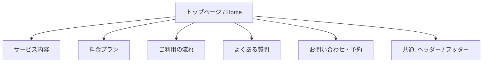

# 猫専用ペットホテルHP 基本設計書

## 1. サイトマップ



- 複数ページ構成のHP
- メインナビゲーションから各下層ページへ遷移

---

## 2. ページ・コンポーネント詳細設計

### 2.1 共通コンポーネント（ヘッダー・フッター）

#### ヘッダー

| 項目           | 内容                                                       |
| -------------- | ---------------------------------------------------------- |
| ロゴ           | サービス名のテキストロゴ or イラストロゴ（トップへリンク） |
| ナビゲーション | サービス / 料金 / ご利用の流れ / FAQ / お問い合わせ        |
| モバイル対応   | ハンバーガーメニューに切り替え                             |
| 固定表示       | スクロール時にヘッダーを固定（sticky）                     |

#### フッター

- サービス名 / ロゴ
- ナビゲーションリンク（各下層ページへ）
- SNSリンク（LINE / Instagram 等）
- コピーライト

### 2.2 トップページ（Home）

| 項目             | 内容                                                     |
| ---------------- | -------------------------------------------------------- |
| メインビジュアル | 猫が部屋で安心してくつろいでいる写真（画面幅いっぱい）   |
| キャッチコピー   | 「1部屋丸ごと貸し出し。猫ちゃんだけの特別なお部屋。」等  |
| コンセプト       | 1部屋丸ごと貸し出しのメリットと安心ポイントを簡潔に紹介  |
| 各ページへの導線 | サービス、料金、ご利用の流れなどへのリンクカード・ボタン |
| CTA              | 「予約ページへ」ボタン                                   |

### 2.3 サービス内容ページ

#### 基本サービス（アイコン付きグリッド表示）

| サービス                         | アイコンイメージ（2色の柔らかい線画イラスト） |
| -------------------------------- | --------------------------------------------- |
| 6畳のお部屋                      | 部屋のイラスト                                |
| 猫トイレ・猫砂完備               | トイレとスコップのイラスト                    |
| 1部屋3頭まで                     | 3匹の猫が並んでいるイラスト                   |
| キャットタワー・キャットウォーク | キャットタワーのイラスト                      |
| ペットカメラ                     | 見守りカメラのイラスト                        |
| ご飯・おやつの提供               | エサ皿と魚のイラスト                          |
| 定期的に遊ぶ時間                 | 猫じゃらしのイラスト                          |
| ブラッシング                     | ブラシとキラキラのイラスト                    |
| 緊急時は動物病院へ               | 病院（十字マーク付きの建物）のイラスト        |
| こまめなLINE報告                 | スマホと吹き出しのイラスト                    |
| 空気清浄機                       | 空気清浄機と風のイラスト                      |

- レイアウト：2〜3カラムのグリッド、モバイルは1カラム

#### 有料オプション

- 追加料金で対応するサービス（爪切り、毛玉取り、足のはみ毛カット等）

### 2.4 料金プランページ

#### 基本料金（猫1匹あたり）

- 連泊に応じた料金一覧を表示

#### 追加料金・オプション

- 2匹目以降：1泊につき +6,000円
- 有料オプション料金

#### 料金シミュレーション（任意実装）

- 泊数セレクト × 頭数セレクト → 合計金額リアルタイム表示

### 2.5 ご利用の流れページ

- ステップ形式で予約から利用・決済までの流れを説明

1. 空室カレンダー確認
2. ペット情報（頭数・猫種）入力
3. 持ち込み有無入力
4. 支払い方法選択
5. 利用規約確認
6. 予約確定・決済（1週間前まで無料キャンセル）

### 2.6 よくある質問（FAQ）ページ

- アコーディオン形式（Q をクリックで A を開閉）
- Q. どんな猫種でも預けられますか？
- Q. おもちゃやフードの持ち込みは可能ですか？
- Q. 泊まっている様子は見れますか？
- Q. 別の猫ちゃんと相部屋になりますか？

### 2.7 お問い合わせ・予約ページ

| 項目         | 内容                                                               |
| ------------ | ------------------------------------------------------------------ |
| メール       | メールアドレスの表示 + mailto リンク                               |
| 公式LINE     | QRコード + 友達追加ボタン                                          |
| 予約フォーム | 名前 / メールアドレス / 電話番号 / ご希望日程 / 頭数 / 猫種 / 備考 |

- フォームはバリデーション付き

---

## 3. レイアウト設計

### ブレイクポイント

| デバイス   | 幅              |
| ---------- | --------------- |
| モバイル   | 〜767px         |
| タブレット | 768px 〜 1023px |
| PC         | 1024px〜        |

### レイアウト方針

- コンテンツ最大幅：1200px（中央寄せ）
- セクション間の余白：80px〜120px
- 白の余白を十分に確保し、猫の写真が映えるデザイン

---

## 4. デザインシステム

### カラーパレット

| 用途               | カラー                      | 参考値    |
| ------------------ | --------------------------- | --------- |
| ベースカラー       | ホワイト                    | `#FFFFFF` |
| サブベースカラー   | アイボリー / ライトベージュ | `#FDF8F3` |
| メインカラー       | ウォームブラウン            | `#8B6F47` |
| アクセントカラー   | ソフトベージュ              | `#D4A574` |
| テキストカラー     | ダークブラウン              | `#3E2C1C` |
| サブテキストカラー | ミディアムブラウン          | `#7A6855` |

### タイポグラフィ

| 用途         | フォント候補                  | サイズ（PC） |
| ------------ | ----------------------------- | ------------ |
| 見出し（h1） | Zen Maru Gothic / Kosugi Maru | 36〜48px     |
| 見出し（h2） | 同上                          | 28〜32px     |
| 見出し（h3） | 同上                          | 20〜24px     |
| 本文         | Noto Sans JP                  | 16px         |
| 補足テキスト | Noto Sans JP                  | 14px         |
| CTA ボタン   | Noto Sans JP Bold             | 16〜18px     |

### アニメーション方針

| 対象              | アニメーション                                        |
| ----------------- | ----------------------------------------------------- |
| ファーストビュー  | ローディング後のフェードイン（0.8〜1s）               |
| コンテンツ表示    | スクロール連動のフェードアップ演出                    |
| CTAボタン         | ホバー時に微細なスケールアップ + 色変化               |
| FAQアコーディオン | スムーズな開閉アニメーション（max-height transition） |

---

## 5. ディレクトリ構成（案）

```text
cat-sitter-hp/
├── docs/                      # ドキュメント
│   ├── requirements.md
│   └── basic-design.md
├── src/
│   ├── index.html             # トップページ
│   ├── service/index.html     # サービス内容ページ
│   ├── pricing/index.html     # 料金プランページ
│   ├── flow/index.html        # ご利用の流れページ
│   ├── faq/index.html         # よくある質問ページ
│   ├── contact/index.html     # お問い合わせ・予約ページ
│   ├── css/
│   │   ├── reset.css          # リセットCSS
│   │   ├── variables.css      # CSS変数（カラー・フォント等）
│   │   ├── base.css           # ベーススタイル
│   │   ├── layout.css         # レイアウト共通
│   │   ├── components/        # 共通コンポーネント用CSS
│   │   └── pages/             # 各ページ専用CSS
│   ├── ts/
│   │   ├── main.ts            # 全ページ共通処理
│   │   ├── navigation.ts      # ナビゲーション制御
│   │   ├── scroll-animation.ts # スクロールアニメーション
│   │   ├── faq-accordion.ts   # FAQアコーディオン
│   │   ├── hamburger-menu.ts  # ハンバーガーメニュー
│   │   ├── form-validation.ts # フォームバリデーション
│   │   └── price-calculator.ts # 料金シミュレーション（任意）
│   └── assets/
│       ├── images/            # 写真素材
│       └── icons/             # アイコン素材（SVG）
├── package.json
├── tsconfig.json
└── vite.config.ts             # Vite設定（複数ページビルド設定）
```

---

## 6. 技術設計

### ビルドツール

- **Vite** を採用（高速なHMR、TypeScript対応、MPAマルチページアプリ設定）

### TypeScript 実装範囲

| モジュール            | 役割                                                     |
| --------------------- | -------------------------------------------------------- |
| `main.ts`             | 各モジュールの初期化、DOMContentLoaded イベント          |
| `navigation.ts`       | スティッキーヘッダー制御、カレントページハイライト       |
| `scroll-animation.ts` | Intersection Observer によるスクロール連動アニメーション |
| `faq-accordion.ts`    | FAQ の開閉ロジック                                       |
| `hamburger-menu.ts`   | モバイルメニューの開閉                                   |
| `form-validation.ts`  | お問い合わせフォームのバリデーション                     |
| `price-calculator.ts` | 料金シミュレーション（任意）                             |

### SEO・メタ情報

各ページごとに最適な `<title>` と `<meta description>` を設定する。
OGPも共通およびページ別に設定。

---

## 7. 画像・素材計画

| 用途                     | 種別           | 調達方法                     |
| ------------------------ | -------------- | ---------------------------- |
| ヒーローメインビジュアル | 写真           | AI生成 or フリー素材         |
| 各ページ用イメージ写真   | 写真           | 同上                         |
| サービスアイコン（11種） | イラスト / SVG | 手描き or アイコンライブラリ |
| ステップアイコン（6種）  | イラスト / SVG | 同上                         |
| OGP画像                  | 画像           | デザインツールで作成         |
| LINE QRコード            | 画像           | LINE公式から取得（モック）   |
